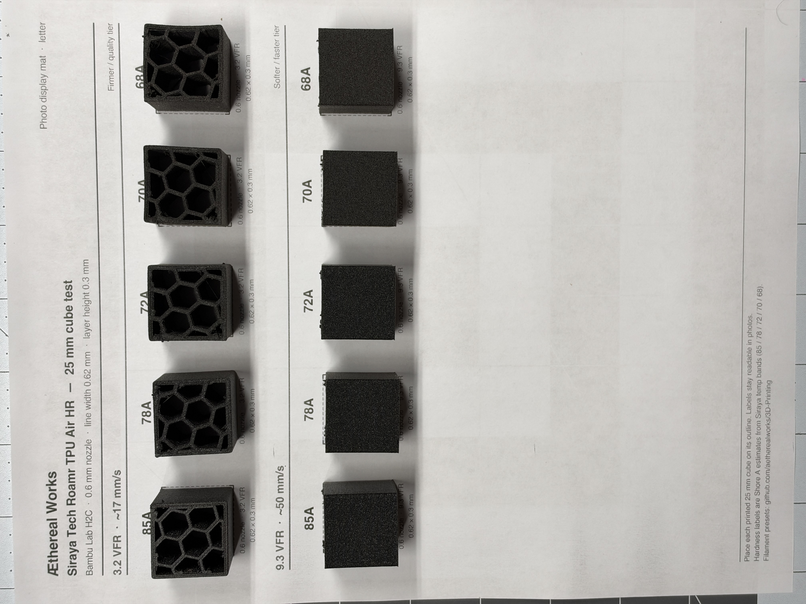
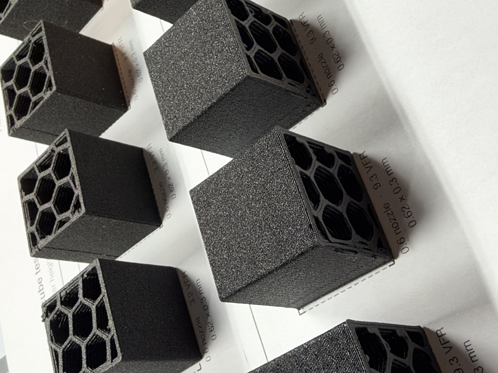
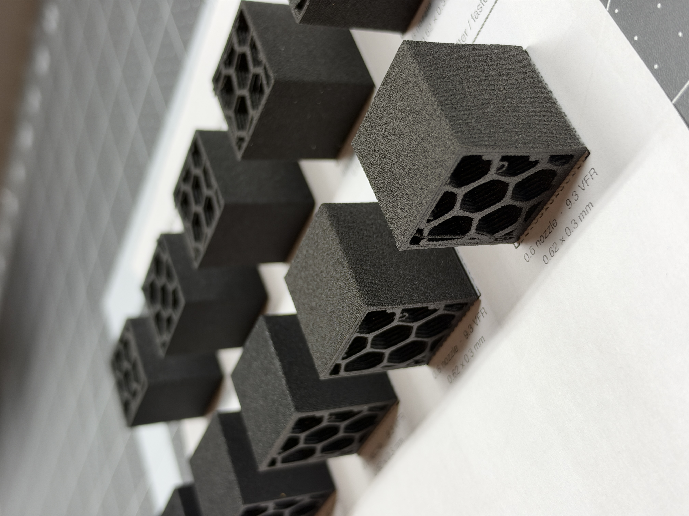
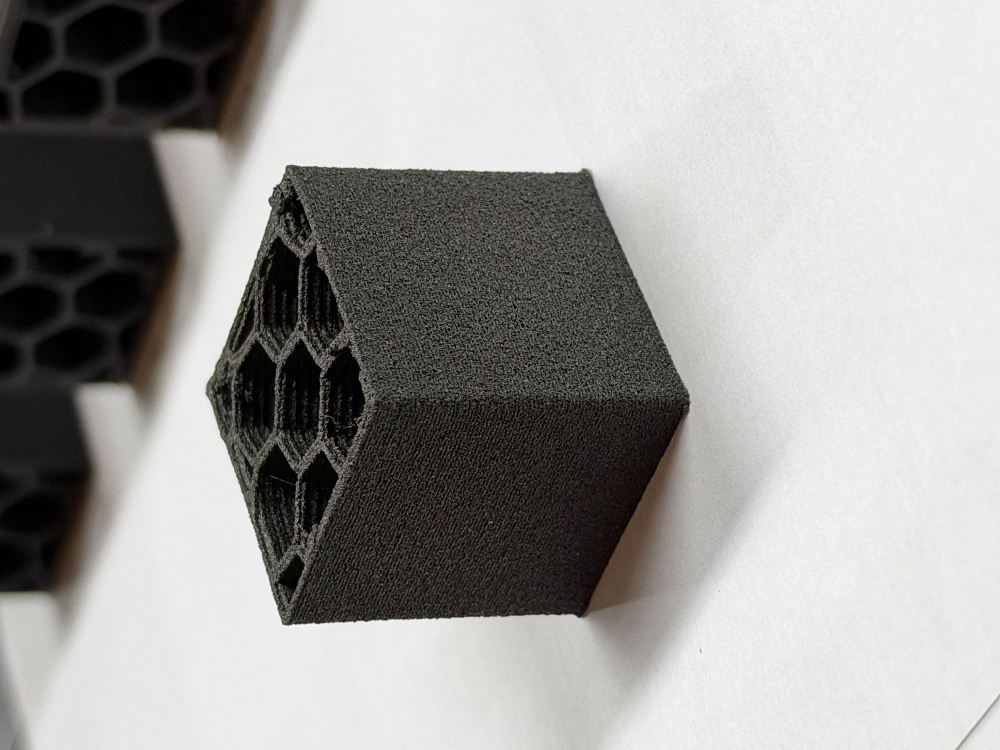

# H2C · 0.6 mm nozzle

**[Æthereal Works - 3D-printing resources](../../../)**

Ten standalone filament presets. Each profile needs **both** the `.json` and the matching `.info`. See the [filament README](../../README.md#how-to-install-bambu-studio) for drop-in and import steps.

- `Siraya Tech Roamr TPU Air HR - 0.6 nozzle - 17 mm-s - 3.2 VFR - 85A`
- `Siraya Tech Roamr TPU Air HR - 0.6 nozzle - 17 mm-s - 3.2 VFR - 78A`
- `Siraya Tech Roamr TPU Air HR - 0.6 nozzle - 17 mm-s - 3.2 VFR - 72A`
- `Siraya Tech Roamr TPU Air HR - 0.6 nozzle - 17 mm-s - 3.2 VFR - 70A`
- `Siraya Tech Roamr TPU Air HR - 0.6 nozzle - 17 mm-s - 3.2 VFR - 68A`
- `Siraya Tech Roamr TPU Air HR - 0.6 nozzle - 50 mm-s - 9.3 VFR - 85A`
- `Siraya Tech Roamr TPU Air HR - 0.6 nozzle - 50 mm-s - 9.3 VFR - 78A`
- `Siraya Tech Roamr TPU Air HR - 0.6 nozzle - 50 mm-s - 9.3 VFR - 72A`
- `Siraya Tech Roamr TPU Air HR - 0.6 nozzle - 50 mm-s - 9.3 VFR - 70A`
- `Siraya Tech Roamr TPU Air HR - 0.6 nozzle - 50 mm-s - 9.3 VFR - 68A`

## Example project

[Siraya Tech - Roamer TPU Air HR 85a.3mf](examples/Siraya%20Tech%20-%20Roamer%20TPU%20Air%20HR%2085a.3mf) — Bambu Studio **85A test project** (download and open in Studio).

## 25 mm cube test

H2C · 0.6 mm nozzle · 0.62×0.3 mm · two tiers only: 3.2 VFR (~17 mm/s) and 9.3 VFR (~50 mm/s) × Shore estimates 85A/78A/72A/70A/68A.

Printable letter-size display mat: [Siraya-Tech-Roamr-TPU-Air-HR-25mm-cube-display.pdf](examples/Siraya-Tech-Roamr-TPU-Air-HR-25mm-cube-display.pdf)

[← Pack notes](../)
